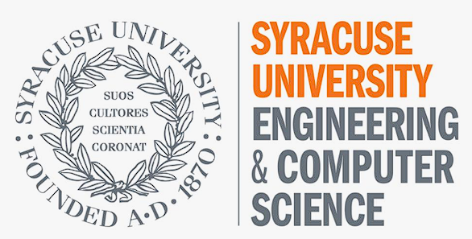

# Documentation Outline

Outline for the `Markdown` based Documentation Repository

| Course| `CIS.454`.*FALL23*.Software Implementation |
|:-----------:|:-------------------:|
| Professor | `Edmond Yu` |
| Version |  `1.0.1`  |
| Recently Update |  `Sep.15 2023`|

# Team Members

| Team Member | Contact Information |
|:-----------:|:-------------------:|
| `Zekai Lin` | zlin48@syr.edu |
| `Shizhan Ma` | sma100@syr.edu |
| `Zhenyang Li` | zli115@syr.edu |
| `Wentao Chen` | wchen01@syr.edu |

## Outline

<!-- Assignment of Week 3 General Plan for the Project -->
[Currently] [Project Manegment Plan](./docs/ProjManage.md) `Sep.15 2023`

[Software Tools](./docs/tools.md) `Sep.15 2023`

[General Semester Project Plan](./docs/General.md) `Sep.15 2023`

## About

<!-- Syntax of Markdown -->
[MarkDown Cheet Sheet](https://www.markdownguide.org/cheat-sheet/) `Sep.10 2023`
