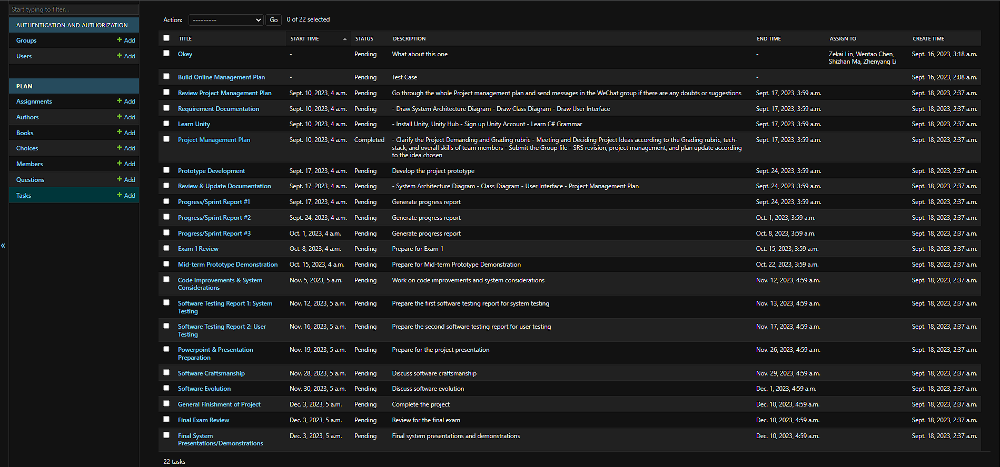

# Project Management Plan

| Project Name | Stand alone 2D Shooting Game |
|:-----------:|:-------------------:|
| Engine | Unity |
| Programing Language | C# |

## Team Members

| Team Member | Contact Information |
|:-----------:|:-------------------:|
| `Zekai Lin` | zlin48@syr.edu |
| `Shizhan Ma` | sma100@syr.edu |
| `Zhenyang Li` | zli115@syr.edu |
| `Wentao Chen` | wchen01@syr.edu |

## Plan

*Week 3* `Sep.10` - `Sep.16`

- [x] **Project Management Plan** - `Zekai Lin` `Due: Sep.14` 

  - [x] Clearify the Project Demanding and Grading rubric
  - [x] Meeting and Deciding Project Ideas according to the Grading rubric, tech-stack and overall skills of team member
  - [x] Submit the Group file
  - [x] SRS revision, project management and plan update according to the idea chosen

- [ ] **Learn Unity** - `Team` `Due: Week 4`
  - Install Unity, Unity Hub
  - Sign up Unity Account
  - Learn C# Grammer
  - [x] `Zekai Lin`
  - [x] `Shizhan Ma`
  - [x] `Zhenyang Li`
  - [ ] `Wentao Chen`
  
- [ ] **Requirement Documentation** - `Zekai Lin` `Due: Week 4`
  - [ ] Draw System Archtecture Diagram
  - [ ] Draw Class Diagram
  - [ ] Draw User Interface

- [ ] **Reveiw Project Management Plan** - `Team` `Due: Week 4`
  > Go through whole Project management plan and Sent message in the wechat group if there is any double or suggestion
  - [ ] `Zekai Lin`
  - [ ] `Shizhan Ma`
  - [ ] `Zhenyang Li`
  - [ ] `Wentao Chen`
  
*Week 4*  `Sep.17` - `Sep.23`

- [ ] **Progress/Sprint Report #1** - `Zekai Lin` `Due: Sep.23`

- [ ] **Review&Update Documentation** - `Team` `Due: Week 4`
  - [ ] System Archtecture Diagram
  - [ ] Class Diagram
  - [ ] User Interface
  - [ ] Project Management Plan

- [ ] **Prototype Development** - `Team` `Due: Week 4`

*Week 5* **- Prototype -** `Sep.24` - `Sep.30`

- [ ] Progress/Sprint Report #2 - `Zekai Lin` `Due: Sep.30`

*Week 6* `Oct.1` - `Oct.7`

- [ ] Progress/Sprint Report #3 - `Zekai Lin` `Due: Oct.7`

- [ ] **Exam 1** Review

*Week 7* `Oct.8` - `Oct.14`

> **Exam 1**: `Oct.12`

*Week 8* `Oct.15` - `Oct.21`

> **Mid-term Prototype Demonstration** `Oct.17 & 19`

*Week 9* `Oct.22` - `Oct.28`

- [ ] Progress/Sprint Report #4 - `Zekai Lin` `Due: Oct.28`

*Week 10* `Oct.29` - `Nov.4`

- [ ] Progress/Sprint Report #5 - `Zekai Lin` `Due: Nov.11`

> **Project Phase: Testable**

*Week 11* `Nov.5` - `Nov.11`
 
- [ ] Code Improvements & System Considerations `Nov.7 & 9`

*Week 12* `Nov.12` - `Nov.18`

- [ ] **Software Testing Report 1**: System Testing `Nov.14`

- [ ] **Software Testing Report 2**: User Testing `Nov.16`

*Week 13* `Nov.19` - `Nov.25`

> ***<--- Thanks Giving Break --->***

- [ ] **Powerpoint & Presentation Preparation**

*Week 14* `Nov.26` - `Dec.2`

> Software Craftsmanship `Nov.28`
>
> Software Evolution `Nov.30`

*Week 15* `Dec.3` - `Dec.9`
>  **Final System Presentations/Demonstrations** `Dec.5`

- [ ] **Final Exam Review**

- [ ] **General Finishment of Project**

Week 16 `Dec.10` - `Dec.16`

>  **Exam 2** `Dec.12`
> 
>  **Term Project Delevery** `Due: Dec.15`